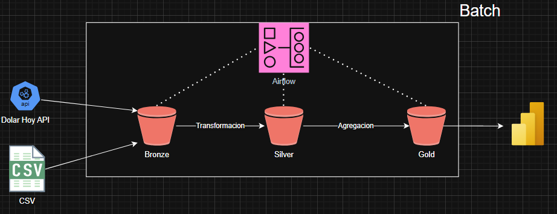

🛒 Product Data Pipeline
Este proyecto implementa un pipeline de procesamiento, limpieza y análisis de datos de productos, con foco en sus características comerciales y precios en USD. Está diseñado para escalar sobre una arquitectura modular y basada en capas, utilizando Airflow y almacenamiento en la nube (AWS S3).

📦 Objetivo
Procesar datos de productos, limpiarlos, transformarlos y almacenarlos en capas organizadas (Bronze, Silver y potencialmente Gold) para su análisis posterior. Este pipeline permite identificar insights como productos más rentables, disponibilidad por categoría o comportamiento de precios.

🔗 Fuentes de Datos
Tipo: Archivos CSV estructurados.

Ejemplo de campos:

Name, Description, Brand, Category

Price (USD), Currency, Stock, EAN

Color, Size, Availability, Internal ID

⚙️ Estructura del Pipeline
🔹 Ingesta
Orquestada por Airflow.

Un sensor diariamente chequea un bucket S3 para ver cuando se sube un nuevo archivo CSV y JSON.


Los archivos es copiado a la capa Bronze en S3.

🔹 Transformación
Aplicada desde DAGs de Airflow.

Conversión a Parquet, compresión con Snappy y particionamiento por fecha.

Se eliminan inconsistencias, se validan tipos de datos y se estandarizan campos.

🔹 Carga
Los datos refinados se cargan a la capa Silver en S3.

Futuramente se integrarán con un data mart o data warehouse para análisis BI.

🗂️ Almacenamiento por Capas (Data Lake)
🥉 Bronze Layer
Origen: CSV, JSON o Parquet.

Destino: Archivos Parquet.

Compresión: Snappy.

Particionamiento: Año > Mes > Día (basado en fecha de procesamiento).

Transformación: Solo cambio de formato y organización.

Retención: Alta (3 años). Conservación de data cruda e histórica.

🥈 Silver Layer
Origen: Archivos Parquet provenientes de la capa Bronze.

Transformaciones:

Conversión de precios a dólares si fuera necesario.

Normalización de disponibilidad (backorder, pre_order, etc.).

Limpieza de descripciones, verificación de EANs.

Compresión: Snappy.

Particionamiento: Año > Mes > Día.

Retención: Media (1.5 años).

🥇 Gold Layer (No implementada en esta versión)
Se reservó espacio para futuras métricas o reportes.

Debido al bajo nivel de transformación requerido, no se implementó en esta entrega.

Retención estimada: Baja (0.5 años).

🗺️ Diagrama de Arquitectura



❓ Preguntas de Negocio
✅ 1. ¿Qué categorías de productos tienen mayor valor promedio por unidad?
🎯 Objetivo: Identificar oportunidades de margen alto y diseñar estrategias de precios.

📊 Datos requeridos: Category, Price, Currency, Stock

📈 Ejemplo de métrica:

```sql
Precio promedio por categoría = AVG(Price) GROUP BY Category
```
✅ 2. ¿Qué disponibilidad de stock tienen los productos con precio mayor a $500 USD?
🎯 Objetivo: Evaluar la capacidad de entrega de productos premium.

📊 Datos requeridos: Price, Availability, Stock

🧮 Ejemplo de lógica:

```sql
SELECT Name, Price, Availability, Stock
FROM products
WHERE Price > 500
```
🐳 Uso con Docker
El pipeline puede ejecutarse usando Docker con variables de entorno para las credenciales de AWS:

```bash
docker run \
  -e ACCESS_KEY=YOUR_ACCESS_KEY \
  -e SECRET_ACCESS_KEY=YOUR_SECRET_ACCESS_KEY \
  henry-2do-pi

```
🔐 Permisos y Seguridad
Se otorgaron permisos IAM a un usuario externo de AWS para que pueda orquestar Airflow y acceder a los buckets.

El acceso está limitado a las acciones necesarias para la ingesta, transformación y carga de datos.